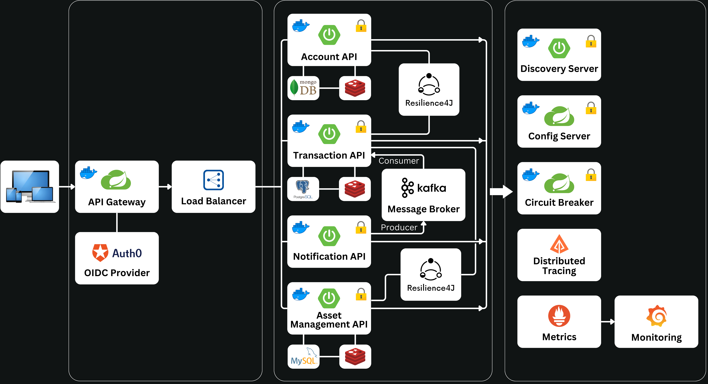
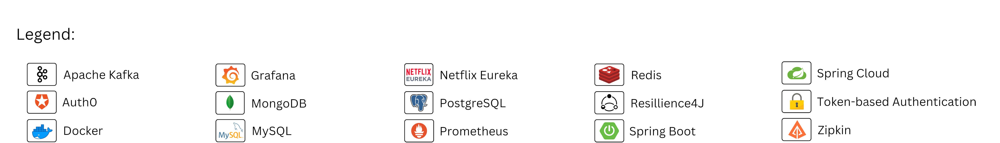
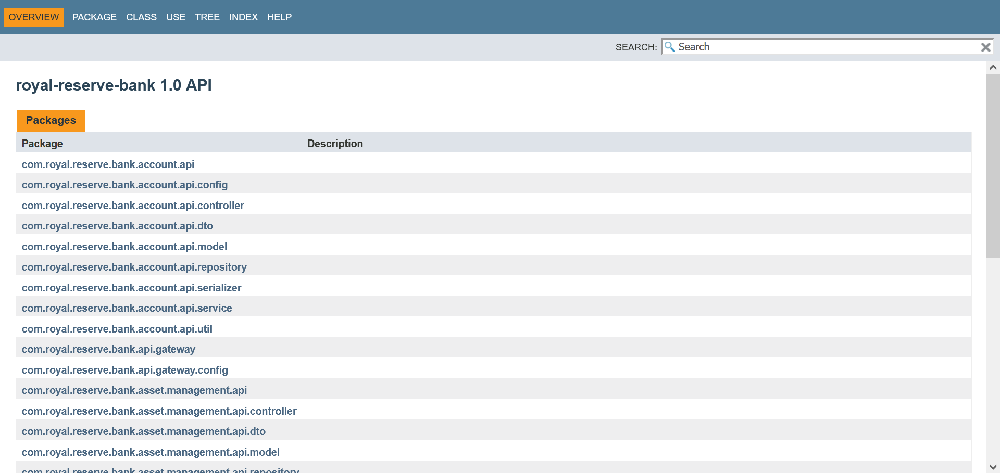
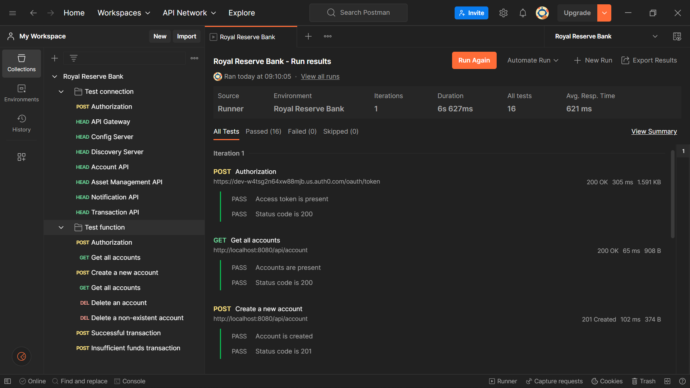
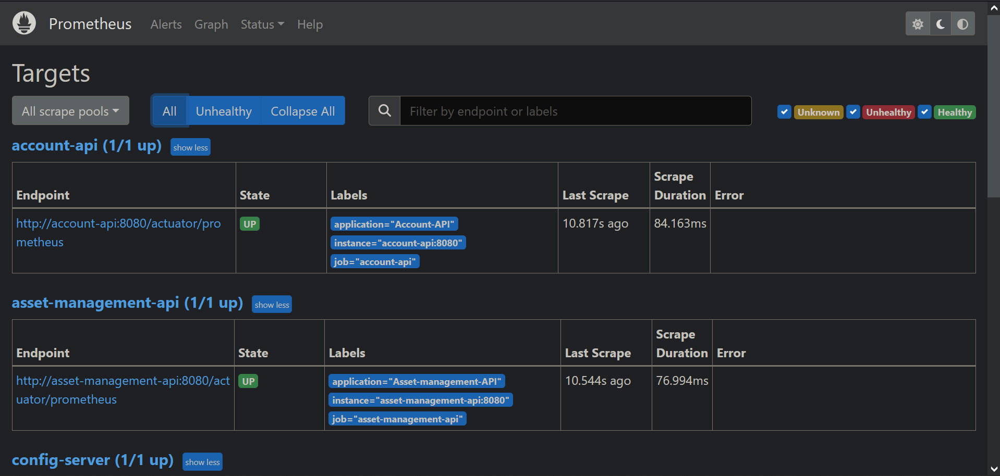
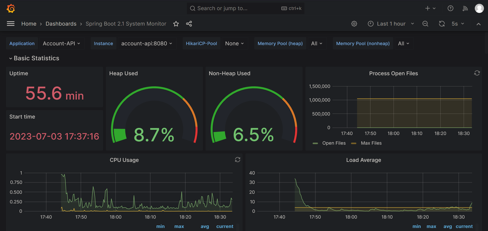

<h1>
  

    
     
    Royal Reserve Bank
  

</h1>

  

    <h1>Table of Contents 🡇</h1>
  

   * [About](#about-)
   * [Solution Architecture](#solution-architecture-)
   * [Microservices](#microservices-)
   * [Clone and Use](#clone-and-use-)
   * [Technologies Used](#technologies-used-)
   * [API Documentation](#api-documentation-)
   * [Testing](#testing-)
      * [Automated Testing](#automated-testing)
      * [Manual Testing](#manual-testing)
   * [Monitoring and Logging](#monitoring-and-logging-)
      * [Prometheus](#prometheus)
      * [Grafana](#grafana)
   * [Contributing](#contributing-)
   * [License](#license-)
   * [Troubleshooting and Support](#troubleshooting-and-support-)
<!--  * [Build](#to-build-the-applications)
      * [Run from Local Environment](#to-run-the-microservices-in-your-local-environment)
      * [Run from Docker](#to-run-the-microservices-within-docker)
      * [Run from Kubernetes](#running-the-microservices-in-kubernetes-on-your-local-machine)
      * [Architecture Patterns](#architecture-patterns)
 -->

# About 🚀

The Royal Reserve Bank is a digital banking solution that utilizes a microservices architecture. It incorporates the latest Spring Boot and Spring Cloud technologies to implement a range of architectural patterns such as service discovery, centralized configuration, distributed tracing, circuit breaker, cache-aside or event-driven architecture.

It consists of several independent modules that work together to provide a scalable and fault-tolerant system. The modules communicate with each other through well-defined APIs and leverage databases for data storage to perform various banking activities, such as account creation, money transfers, asset management and sending email or SMS notifications.

# Solution Architecture 🔍

The Royal Reserve Bank project is designed using a microservices architecture, which structures the application as a collection of loosely coupled services. Each service represents a specific business capability and can be developed and scaled independently.

<picture>
  <source media="(prefers-color-scheme: dark)" srcset="./docs/readme-assets/high-level-architecture-dark.png">
  
</picture>

<picture>
  <source media="(prefers-color-scheme: dark)" srcset="./docs/readme-assets/high-level-architecture-legend-dark.png">
  
</picture>

## Architecture Patterns

The key architectural patterns used in the project include:

- **Service Discovery:** The microservices use the Discovery Server for service registration and discovery. This pattern enables microservices to locate and communicate with each other dynamically without the need for hard-coded endpoints. It improves the system's resilience and scalability by allowing services to adapt to changes in the environment and handle load balancing efficiently.
<!--  -->
- **Centralized Configuration:** The Config Server provides centralized management of configuration settings for all microservices. This pattern simplifies the configuration process and allows for dynamic updates without the need to restart services. It enhances the maintainability of the microservices and makes it easier to manage configurations in different environments.
<!--  -->
- **Distributed Tracing:** The project uses Zipkin, a distributed tracing system, to track and analyze the flow of requests across microservices. Distributed tracing allows developers and system administrators to understand the performance and behavior of requests as they travel through multiple microservices. By instrumenting the microservices with tracing code, Zipkin collects timing and tracing data, which can be used to identify bottlenecks, troubleshoot issues, and optimize the system's performance.
<!--  -->
- **Event-driven Architecture:** The Notification API module utilizes Apache Kafka, a distributed streaming platform, for asynchronous communication. Kafka provides a reliable and scalable messaging system that decouples the sender and receiver of messages. When a microservice needs to send a notification, it publishes a message to a specific Kafka topic. The Notification API, acting as a consumer, receives the message and processes it accordingly. Asynchronous communication allows the system to handle notification processing separately from the main request flow, improving performance and scalability.
<!--  -->
- **Database per Microservice:** Each microservice in the Royal Reserve Bank project has its own dedicated database. The Account API communicates with a MongoDB database, the Transaction API uses PostgreSQL, and the Asset Management API interacts with a MySQL database. This approach of having a database per microservice ensures data isolation and autonomy. It allows each microservice to manage its own data schema, optimize database operations based on specific requirements, and scale independently as needed.
<!--  -->
- **Cache-aside Pattern:** Caching plays a crucial role in enhancing performance and reducing database load in microservices architecture. The Account API utilizes Redis template, while the Asset and Transaction API leverage Spring Cache. When a request requires data, the microservice first checks the cache. If the data is available, it is retrieved from the cache, avoiding the need to fetch it from the database. This caching strategy efficiently reduces response times and enhances the overall performance of the system.
<!--  -->
- **Circuit Breaker Pattern:** The Circuit Breaker pattern is used to handle faults and failures in distributed systems. It acts as a safeguard to prevent cascading failures when a microservice is unavailable or experiencing high latency. The Circuit Breaker is implemented using Resilience4J library in the Transaction API. If it detects failures or slow responses, it "opens the circuit" and redirects subsequent requests to a fallback mechanism or returns an error response directly. This helps to protect the overall system from overloading and allows it to gracefully degrade when dependencies are unavailable.
<!-- - **Centralized Logging:** In a microservices architecture, it's crucial to have a centralized logging system to collect and analyze logs from various microservices. Centralized logging enables easy monitoring, troubleshooting, and analysis of the system's behavior. The microservices in the Royal Reserve Bank project send their logs to ELK platforms (Elasticsearch, Logstash, and Kibana). These platforms allow developers and operations teams to search, filter, and visualize logs, making it easier to detect and diagnose issues, track system performance, and ensure compliance with security and operational requirements. -->
- **Security Pattern:** The Royal Reserve Bank project incorporates security measures throughout the architecture. The API Gateway handles authentication and authorization, ensuring that only authenticated and authorized requests reach the microservices. The microservices themselves follow secure coding practices and implement appropriate security controls, such as input validation, encryption of sensitive data, and protection against common vulnerabilities.
<!--  -->
- **Containerization and Orchestration:** The microservices are containerized using Docker, allowing them to run in isolated environments with their dependencies. Containerization provides consistency in deploying microservices across different environments. The containerized microservices are then orchestrated using a container orchestration platform called Kubernetes. Kubernetes manages the deployment, scaling, and monitoring of the microservices, ensuring high availability and fault tolerance.

# Microservices 📋

1. **Account API:** The Account API module provides functionalities for managing accounts. It acts as an account catalog and communicates with a MongoDB database. It allows customers to create new accounts, retrieve account details, delete account information, and perform operations such as balance inquiries and transaction history retrieval.
<!--  -->
2. **Transaction API:** The Transaction API module handles the processing of financial transactions. It communicates with a PostgreSQL database to store transaction records. Customers can initiate transfers and perform financial transactions by leveraging this API. The Transaction API ensures data consistency by communicating synchronously with the Account API and Asset Management API to check the availability of funds and assets before processing any transaction.
<!--  -->
3. **Asset Management API:** The Asset Management API module communicates with a MySQL database that maintains asset data. This API enables customers to query asset availability, such as checking stocks, bonds, derivatives or other financial instruments. The Transaction API interacts with the Asset Management API to ensure that sufficient assets are available for transactions.
<!--  -->
4. **Notification API:** The Notification API module is responsible for sending notifications to customers. It is a stateless microservice that does not have its own database. Instead, it communicates asynchronously with other modules to send notifications after specific events, such as successful transactions or account updates. The Notification API leverages Apache Kafka messaging system to ensure reliable message delivery and scalable notification processing.
<!--  -->
5. **API Gateway:** The API Gateway module provides a single entry point for customers to interact with the microservices. It acts as a reverse proxy, routing customer requests to the appropriate microservice. The API Gateway handles authentication, authorization, and security concerns, ensuring that only authorized requests reach the microservices. The API Gateway improves the overall system performance and provides a unified interface for clients.
<!--  -->
6. **Config Server:** The Config Server module centralizes the configuration management for the microservices. It allows the microservices to retrieve their configuration details from a centralized location, simplifying the configuration process. The Config Server supports features such as environment-specific configurations, and dynamic configuration updates without requiring service restarts. It enhances the maintainability and scalability of the microservices architecture.
<!--  -->
7. **Discovery Server:** The Discovery Server acts as a central registry where each microservice registers itself upon startup. Service discovery enables microservices to find and interact with each other without relying on hardcoded endpoint configurations. It uses Netflix Eureka to enhance the flexibility of the microservices architecture by enabling dynamic and efficient communication between services.

# Clone And Use 🔨

### To build the applications:

- Start the config-server application.
- Start the supporting services in Docker using Docker Compose by running the command `docker-compose docker-compose-infrastructure-services.yml up -d`.
- Open a terminal or command prompt and navigate to the project's root directory.
- Run the command `mvn clean install -pl !config-server` to build all the applications.
- To build a specific application, run the command `mvn clean install -pl <module-name>`. For example, to build the Account API, run the command `mvn clean install -pl account-api`.

### To run the microservices in your local environment:

- Ensure that you have Java 17, Maven, and a compatible IDE (such as [IntelliJ IDEA](https://www.jetbrains.com/idea/download/) or [Eclipse](https://www.eclipse.org/downloads/)) installed and properly configured.
- Clone the repository and navigate to the project directory.
- Start the supporting services in Docker using Docker Compose by running the command `docker-compose docker-compose-infrastructure-services.yml up -d`.
- To launch the applications, run each application in its respective module. Note that the config-server module should be started first.

### To run the microservices within Docker:

- Clone the repository and navigate to the project directory.
- Start the microservices using Docker Compose by running the command `docker-compose up -d`.
- To stop the microservices, run the command `docker-compose down`.

### To run the microservices in Kubernetes on your local machine:

- Ensure that you have Minikube and kubectl installed and properly configured.
- Start Minikube cluster by running the command `minikube start`.
- Apply the Kubernetes deployment configuration by running the command `kubectl apply -f kubernetes-deployment.yaml`.
- Monitor the deployment by running the command `kubectl get pods`. Once all the pods are in the "Running" state, the application is successfully deployed.
- To stop the application, run the command `kubectl delete -f kubernetes-deployment.yaml`.
- To stop Minikube, run the command `minikube stop`.

# Technologies Used 💡

The Royal Reserve Bank project utilizes the following technologies and frameworks:

- **Java 17:** for implementing the microservices.
- **Spring Boot:** for simplifying the development and deployment of microservices by using pre-configured templates and tools.
- **Spring Cloud:** for implementing microservices architectural patterns, such as service discovery, configuration management, and circuit breakers.
- **Docker:** for containerization of microservices, making it easy to package and deploy the microservices across different environments.
- **Kubernetes:** for container orchestration in the microservices, allowing to deploy and manage the microservices across different environments.
- **API Gateway:** for managing and routing API requests from users to different microservices and providing a unified entry point.
- **JPA:** for implementing the Object Relational Mapping in the microservices, allowing Java applications to interact with databases and perform CRUD.
- **MongoDB:** for storing account data in the Account API allowing flexibility and scalability in handling large amounts of unstructured data.
- **PostgreSQL:** for storing transaction data in the Transaction API.
- **MySQL:** for storing asset data in the Asset Management API.
- **Kafka:** for implementing asynchronous communication between microservices.
- **Auth0:** for implementing authentication and authorization functionalities in the microservices, allowing secure access control.
- **Prometheus:** for monitoring and alerting in the microservices, providing insights into the performance and health of the microservices.
- **Grafana:** for monitoring and logging the microservices, providing insights into the performance and health of the microservices.
- **Zipkin:** for distributed tracing in microservices architecture, allowing to track and analyze the flow of requests and performance analysis.
- **Redis:** for caching frequently accessed data in the microservices, improving performance by reducing the load on the underlying data sources.
- **JUnit:** for implementing unit tests in the microservices, allowing to test individual components and ensure that they are working as expected.
- **Mockito:** for implementing mock objects in the microservices, allowing to test the interactions between the various components.
- **Postman:** for testing the microservices, allowing to send requests to the APIs and receive responses.

For a complete list of dependencies and versions, please refer to the `pom.xml` files in the respective module directories.

# API Documentation 📚

The Reserve Bank API documentation provides detailed information about the available endpoints, their functionalities, request/response formats, and authentication requirements. The documentation is generated from the Javadoc comments within the source code.
<!-- -->
To access the full API documentation, navigate to the root directory and execute the command `mvn javadoc:aggregate`. The generated Javadoc will be available in the target/site/apidocs folder. For convenience, I have exported the documentation to the [javadoc folder](./docs/javadoc) in the docs/ directory.

<picture>
  <source media="(prefers-color-scheme: dark)" srcset="./docs/readme-assets/api-documentation-dark.png">
  
</picture>

<!-- add section about swagger doc here -->

# Testing ✅

The project includes comprehensive unit tests and integration tests for each microservice. Additionally, you can use Postman to interact with the Royal Reserve Bank APIs and perform manual testing. The project provides a Postman collection and environment file for easy import and configuration.

### Automated Testing

To run the tests, follow these steps:

- Start the config-server application.
- Open a terminal or command prompt and navigate to the project's root directory.
- To run all the unit tests, use the command `mvn test`.
- If you specifically want to run the integration tests, use the command `mvn failsafe:integration-test`.
- Alternatively, if you prefer to run only the unit tests, use the command `mvn test -Dgroups="!integration"`.

### Manual Testing

To perform manual testing using Postman, follow these steps:

- Install Postman if you haven't already.
- Import the provided Postman [collection](./postman/postman-collection.json) and [environment](./postman/postman-environment.json) JSON files located in the postman/ folder.
- Select the imported "Royal Reserve Bank" collection and choose the desired request from the available endpoints.
- Set the imported "Royal Reserve Bank" environment as the active environment in Postman.
- Run the "Authorization" POST request to receive authorization tokens.
- Customize the request parameters, headers, and body as required.
- Click the "Send" button to execute the request and observe the response.
- Analyze the response data and verify that it matches the expected behavior.

<picture>
  <source media="(prefers-color-scheme: dark)" srcset="./docs/readme-assets/manual-testing-with-postman-dark.png">
  
</picture>

Remember to ensure that the Royal Reserve Bank microservices are running before executing the requests in Postman to ensure successful communication with the APIs.

# Monitoring and Logging 📊

The project uses Prometheus and Grafana for monitoring and logging the microservices. The Prometheus server collects metrics from the microservices and stores them in a time-series database. The Grafana server then queries the Prometheus server to retrieve the metrics and display them in the form of visualizations and dashboards.

### Prometheus

- Ensure that you have Prometheus running in Docker environment.
- Access the Prometheus dashboard by navigating to `http://localhost:9090` in your browser.
- The Prometheus dashboard displays the metrics collected from the microservices.
- You can use the query field to search for specific metrics and visualize them in the form of graphs.
- The "Status" tab displays the status of the Prometheus server and the targets that it is scraping metrics from.
- The "Alerts" tab displays any alerts that have been triggered based on the metrics.
- You can also use the "Graph" tab to view the metrics in the form of graphs.

<picture>
  <source media="(prefers-color-scheme: dark)" srcset="./docs/readme-assets/prometheus-metrics-dark.png">
  
</picture>

### Grafana

To set up Grafana with Prometheus as the data source and configure a dashboard using a specific dashboard ID, follow these steps:

- Ensure that you have both Grafana and Prometheus running in Docker environment.
- Open your web browser and access the Prometheus by navigating to `http://localhost:9090` (or the appropriate URL if you have a different setup).
- Check the status of the services in Prometheus by navigating to status and targets.
- Open your web browser and access the Grafana by navigating to `http://localhost:3000`.
- Log in to Grafana using your username and password set in the Docker Compose YAML file. The default credentials are (admin/password).
- Once logged in, go to the Connections section in the left-hand menu.
- In the Connections section, select the Data Sources option in the left-hand panel.
- Click on the "Add data source" button to add a new data source for Prometheus.
- Provide the `http://prometheus:9090` in the URL field and save the configuration.
- After adding the Prometheus data source, click on the plus icon on the top-right corner to import a dashboard.
- In the "Import via grafana.com" section, add ID `11378`.
- Select the Prometheus data source that you added in the previous step.
- Review the imported dashboard and make any necessary modifications or adjustments.
- You can now view and interact with the imported dashboard, which will display the metrics and visualizations based on the Prometheus data source.

<picture>
  <source media="(prefers-color-scheme: dark)" srcset="./docs/readme-assets/grafana-dashboard-dark.png">
  
</picture>

<!--
# Deployment

The project can be deployed to various environments such as development, staging, and production. Please refer to the individual module directories for instructions on deploying each microservice.

# Continuous Integration/Deployment

The project uses a CI/CD pipeline configured with Jenkins. Any changes pushed to the main branch trigger an automatic build and deployment process to the staging environment. The CI/CD configuration details can be found in the Jenkinsfile in the project root directory.
 -->

# Contributing 🤝

Contributions to the Reserve Bank project are welcome! If you encounter any bugs, have feature ideas, or would like to contribute code, please feel free to submit a pull request. Your valuable contributions are highly appreciated. Please make sure to follow the standard pull request guidelines. Thank you!

# License 🌐

The Royal Reserve Bank project is licensed under the [MIT License.](./LICENSE)

# Troubleshooting and Support ❓

I'm here to help! If you have any questions, feedback, or need assistance, please feel free to reach out to me. You can send me a message via discussions [here.](https://github.com/zoltanvin/royal-reserve-bank/discussions/categories/q-a)

⭐ **Star me on GitHub — it helps!**
<!--
mvn clean compile jib:build && docker-compose down && docker-compose pull && docker compose up -d
 -->
